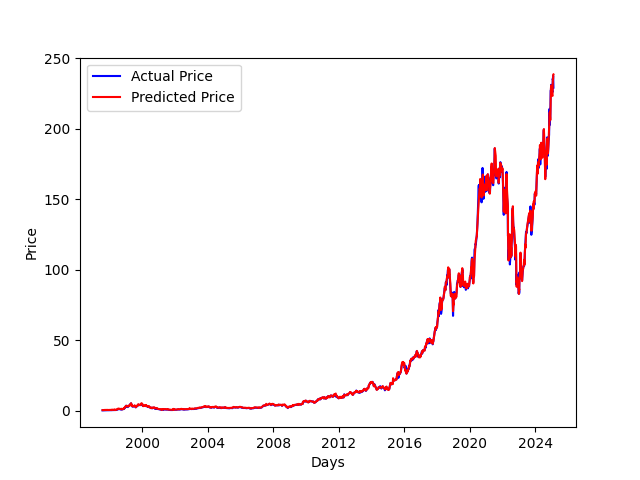

# **LTSM Stock Predictor**
[](https://github.com/yapkhaichuen/LTSM-Stock-Predictor/actions/workflows/model-training.yml) [](https://github.com/yapkhaichuen/LTSM-Stock-Predictor/actions/workflows/generate-report.yml)

Predicting different stock prices using Long Short-Term Memory Recurrent Neural Network in Python using TensorFlow 2 and Keras. Highly customizable for different stock tickers. Current ticker: AMZN (Amazon).

View deployment here: <br>
[GitHub Pages](https://yapkhaichuen.github.io/LTSM-Stock-Predictor)

## **Basic Usage**
1. Install the required libraries by running ***pip install -r requirements.txt***.
1. Run ***train.py*** to train our model. (This will take some time approx. 4 hours)
2. After training ends, run ***tensorboard --logdir="logs"*** to view the Huber loss as specified in the LOSS parameter, the curve is the validation loss. You can also increase the number of epochs to get much better results.
3. Run ***test.py*** to test the model and to output the result

Note: the project is currently running on GitHub Actions, you can take a look at the example output down below. GitHub Actions allows the code to be ran offsite hence freeing up your development computer.

## **Raw data**
<!-- MARKDOWN-AUTO-DOCS:START (CODE:src=https://raw.githubusercontent.com/yapkhaichuen/LTSM-Stock-Predictor/main/data.json) -->
<!-- The below code snippet is automatically added from https://raw.githubusercontent.com/yapkhaichuen/LTSM-Stock-Predictor/main/data.json -->
```json
[
    {
        "Ticker": "AMZN",
        "Future price after": "1 day",
        "Predicted price for 2023-01-05": "86.06$",
        "Mean absolute error": 0.7185575083665566,
        "Accuracy score": 0.5097580015612803,
        "Total buy profit": 27.03479796648027,
        "Total sell profit": 10.12388258427374,
        "Total profit": 37.15868055075401,
        "Profit per trade": 0.029007557026349738,
        "Generated": "2023-01-04 20:11:50.598594+08:00"
    }
]
```
<!-- The below code snippet is automatically added from https://raw.githubusercontent.com/yapkhaichuen/LTSM-Stock-Predictor/main/data.json -->
<!-- MARKDOWN-AUTO-DOCS:END -->

## **Generated report**
<!-- MARKDOWN-AUTO-DOCS:START (JSON_TO_HTML_TABLE:src=./data.json) -->
<table class="JSON-TO-HTML-TABLE"><thead><tr><th class="ticker-th">Ticker</th><th class="future-price-after-th">Future price after</th><th class="predicted-price-for-2023-01-05-th">Predicted price for 2023-01-05</th><th class="mean-absolute-error-th">Mean absolute error</th><th class="accuracy-score-th">Accuracy score</th><th class="total-buy-profit-th">Total buy profit</th><th class="total-sell-profit-th">Total sell profit</th><th class="total-profit-th">Total profit</th><th class="profit-per-trade-th">Profit per trade</th><th class="generated-th">Generated</th></tr></thead><tbody ><tr ><td class="ticker-td td_text">AMZN</td><td class="future-price-after-td td_text">1 day</td><td class="predicted-price-for-2023-01-05-td td_text">86.06$</td><td class="mean-absolute-error-td td_num">0.7185575083665566</td><td class="accuracy-score-td td_num">0.5097580015612803</td><td class="total-buy-profit-td td_num">27.03479796648027</td><td class="total-sell-profit-td td_num">10.12388258427374</td><td class="total-profit-td td_num">37.15868055075401</td><td class="profit-per-trade-td td_num">0.029007557026349738</td><td class="generated-td td_text">2023-01-04 20:11:50.598594+08:00</td></tr></tbody></table>
<!-- MARKDOWN-AUTO-DOCS:END -->

## **Graphs**



Disclaimer: This is **not** finanical advice. Please don't bet your life savings on this.
